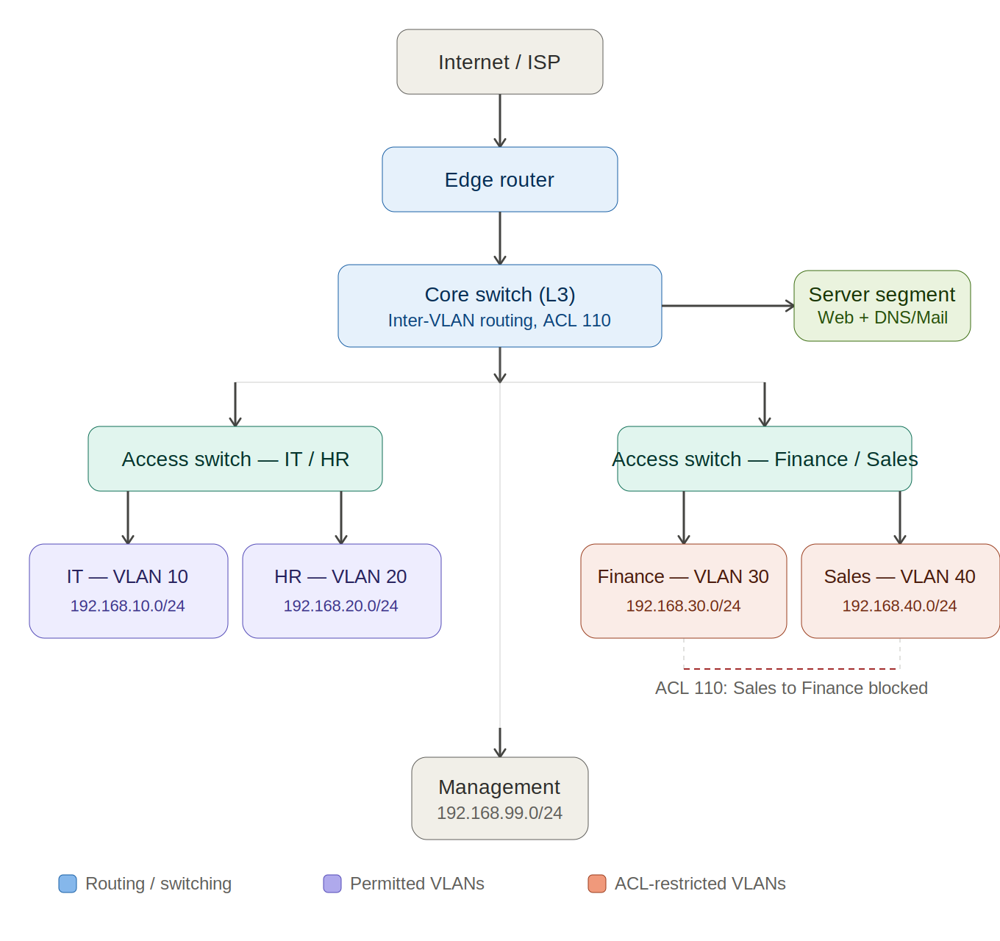

# Enterprise Network Infrastructure

A segmented enterprise network designed and configured in Cisco Packet Tracer, demonstrating VLAN segmentation, inter-VLAN routing, DHCP automation, and access control between departments.

## Overview

This project simulates a small enterprise network for a company with multiple departments (IT, HR, Finance, Sales) plus a Management VLAN and a server segment hosting Web and DNS/Mail services. It was built to apply core networking concepts — VLANs, routing, DHCP, and ACL-based security — in a realistic topology rather than isolated lab exercises.



## What This Network Does

- **Segments departments into VLANs** so each department's traffic is logically isolated at Layer 2
- **Routes between VLANs** so departments that should communicate, can — while others are restricted
- **Automatically assigns IP addresses** to every device via DHCP, scoped per VLAN
- **Enforces access control** between departments using an ACL (e.g., Sales is blocked from reaching Finance)
- **Hosts core services** (Web server, DNS/Mail server) on a dedicated server segment

## Network Design

### VLAN / IP Addressing Scheme

| VLAN ID | Department  | Subnet            | Gateway        |
|---------|-------------|-------------------|----------------|
| 10      | IT          | 192.168.10.0/24   | 192.168.10.1   |
| 20      | HR          | 192.168.20.0/24   | 192.168.20.1   |
| 30      | Finance     | 192.168.30.0/24   | 192.168.30.1   |
| 40      | Sales       | 192.168.40.0/24   | 192.168.40.1   |
| 99      | Management  | 192.168.99.0/24   | 192.168.99.1   |

### Topology

- **Core/Distribution Switch** — Layer 3 switch handling VLAN routing
- **Access Switches** — connect end-user devices, assign switchports to the correct VLAN
- **Edge Router** — connects the internal network outward
- **Server Segment** — hosts a Web Server and a DNS/Mail Server
- **End Devices** — PCs distributed across IT, HR, Finance, and Sales VLANs

## Key Features Implemented

### 1. VLAN Segmentation
Each department sits on its own VLAN, isolating broadcast traffic and creating clear network boundaries between teams.

### 2. Inter-VLAN Routing
Devices in different VLANs can reach each other through the Layer 3 switch where permitted. Verified by pinging across VLANs (e.g., IT → HR gateway succeeds).

### 3. DHCP
Each VLAN has its own DHCP scope, so devices automatically receive the correct IP, subnet mask, gateway, and DNS server with no manual configuration.

### 4. Access Control (ACL)
An extended ACL restricts Sales (VLAN 40) from accessing Finance (VLAN 30), while permitting all other traffic:

```
Extended IP access list 110
10 deny ip 192.168.40.0 0.0.0.255 192.168.30.0 0.0.0.255
20 permit ip any any
```

This models a real-world need — preventing one department from accessing another's sensitive resources.

### 5. Server Segment
A Web Server and a DNS/Mail Server are hosted on the network, representing core services a real enterprise would need to provide internally.

## Verification & Testing

| Test | Result |
|---|---|
| PC receives correct VLAN-scoped IP via DHCP | ✅ Passed |
| Ping between permitted VLANs (e.g., IT → HR) | ✅ Succeeded |
| Ping from Sales to Finance (ACL-restricted) | ✅ Blocked as expected |
| `show vlan brief` confirms VLAN configuration | ✅ Confirmed |
| `show access-lists` confirms ACL is active | ✅ Confirmed |

See `/screenshots` for proof of each test.

## Repository Structure

```
enterprise-network-infrastructure/
├── README.md
├── topology-diagram.png
├── ip-addressing-table.md
├── enterprise-network.pkt
├── configs/
│   ├── core-switch-config.txt
│   ├── edge-router-config.txt
│   └── access-switch-config.txt
└── screenshots/
    ├── topology-overview.png
    ├── vlan-table.png
    ├── ping-test.png
    └── dhcp-verification.png
```

## How to Open This Project

1. Download [Cisco Packet Tracer](https://www.netacad.com/courses/packet-tracer) (free with a Cisco Networking Academy account)
2. Open `enterprise-network.pkt`
3. Use Simulation Mode to trace packets hop-by-hop, or Realtime Mode to test connectivity directly via each device's Command Prompt

## Skills Demonstrated

- Network segmentation and VLAN design
- Inter-VLAN routing configuration
- DHCP server configuration
- Access Control List (ACL) design for departmental security
- Enterprise network topology planning
- Cisco IOS CLI configuration

## What I Learned

Building this project reinforced how enterprise networks are designed in layers — separating departments logically (VLANs), enabling controlled communication between them (routing + ACLs), and reducing manual overhead (DHCP). It also highlighted how a single misconfigured ACL or VLAN assignment can silently break connectivity, which made testing and verification just as important as the initial configuration.

---

*Project by Mehwar — BS Cybersecurity, University of Management and Technology (UMT), Lahore*
